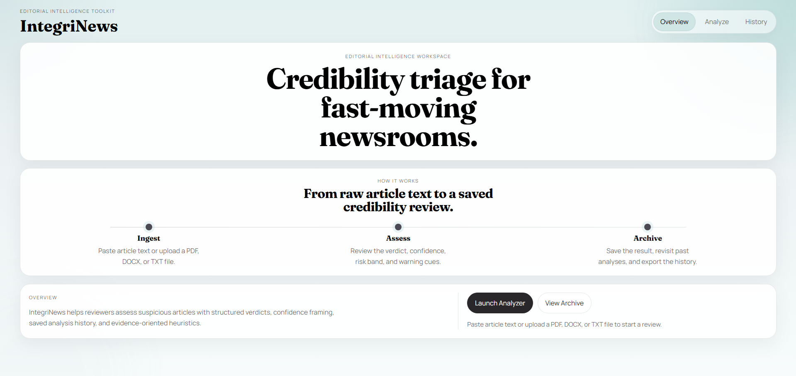
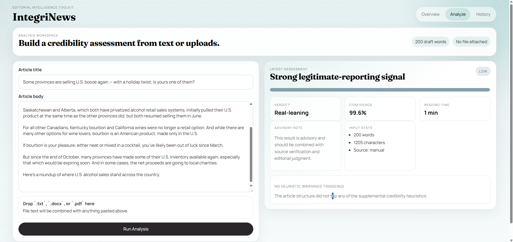

# IntegriNews

IntegriNews is a fake-news analysis product for quick credibility review. It uses the existing TensorFlow classifier as the scoring engine and presents results through structured verdicts, confidence framing, saved analysis history, CSV export, and lightweight heuristic warnings.



## Why This Version Is Stronger
- Modern architecture with `FastAPI`, `React`, and `TypeScript`
- Persistent analysis history backed by `SQLite`
- Drag-and-drop upload support for `.txt`, `.docx`, and `.pdf`
- Clear result framing with verdict, risk band, confidence meter, and advisory note
- Reproducible setup with focused backend and frontend test coverage

## Product Flow
1. Open the landing page and launch the analyzer.
2. Paste article text or upload a supported document.
3. Submit the analysis request to the FastAPI backend.
4. Review the saved result, heuristic warning badges, and confidence framing.
5. Use the history view to inspect prior analyses or export the archive as CSV.



## Architecture
### Backend
- `POST /analyze`: runs inference, parses uploaded files, computes explanation metadata, persists the result
- `GET /analyses`: returns saved analysis history for the archive view
- `GET /analyses/{id}`: returns the full saved article and result detail
- `GET /analyses/export.csv`: exports saved analyses
- `GET /health`: readiness check

### Frontend
- Minimal landing page with product overview, process rail, and entry points into the app
- Analyzer workspace with paste input, drag-and-drop upload, and live draft metadata
- Result panel with verdict band, confidence meter, advisory caveat, and warning badges
- History page with saved analyses, high-level trend cards, and detailed drill-down


## Repository Layout
```text
backend/
  app/
  model_assets/
  tests/
frontend/
  src/
assets/
```

## Local Setup

### Backend
```bash
cd backend
py -m venv .venv
.venv\Scripts\activate
py -m pip install -r requirements.txt
copy .env.example .env
uvicorn app.main:app --reload
```

### Frontend
```bash
cd frontend
npm install
copy .env.example .env
npm run dev
```

The frontend defaults to `http://localhost:8000` for the API.

## Tests

### Backend
```bash
cd backend
pytest
```

### Frontend
```bash
cd frontend
npm test
```

## Model Asset Strategy
- The TensorFlow model is stored under `backend/model_assets/`.
- `backend/model_assets/fakenewsdetector.h5` remains tracked through Git LFS.
- The tokenizer pickle is stored alongside the model and loaded lazily by the backend service.

## Tradeoffs And Limitations
- The classifier is still the original model, so the upgrade focuses on product quality rather than retraining.
- Explanation features are heuristic and advisory; they do not claim deep model interpretability.
- There is no authentication, article scraping, or external news-source verification in v1.
- Deployment is intentionally deferred until the rebuilt local product is stable and reviewable.
